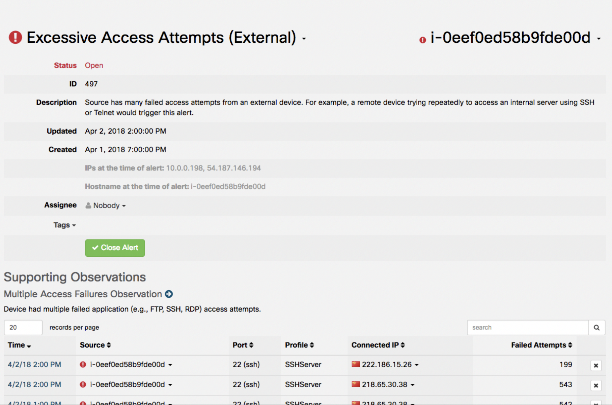
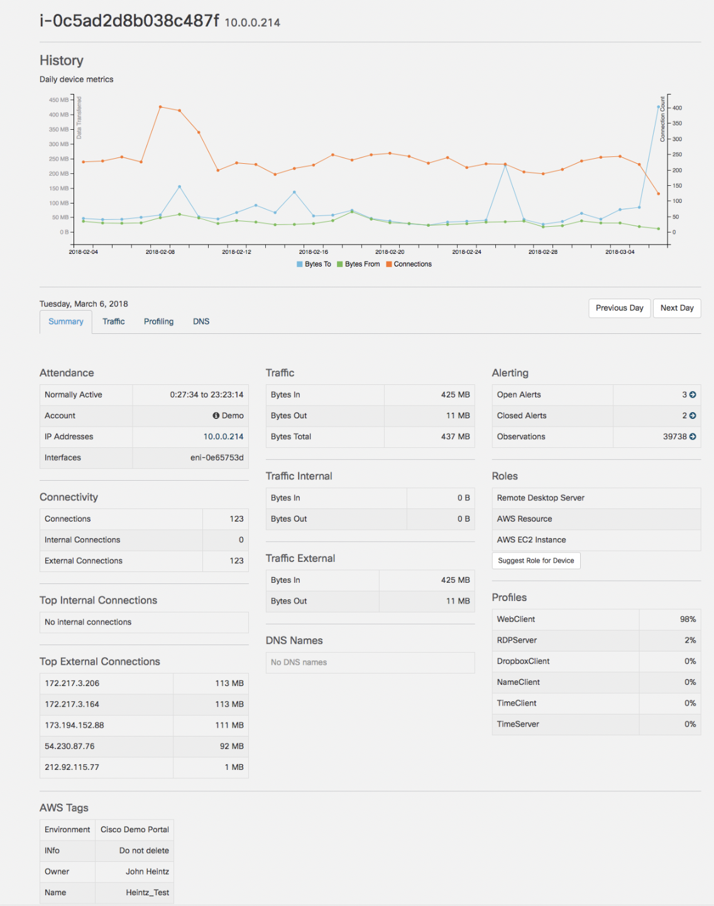
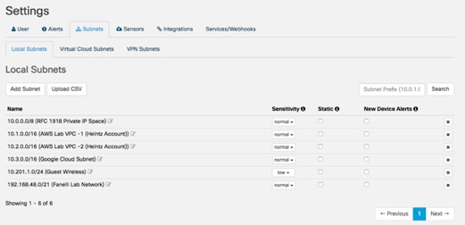
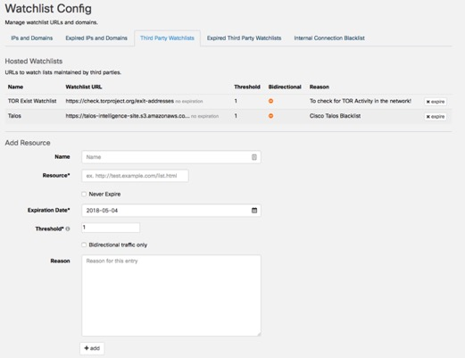

# Cisco Stealthwatch Cloud Demo 

Cisco Stealthwatch Cloud provides comprehensive network visibility and security threat detection from the datacenter to the cloud. It is composed of two products: PCM (Public Cloud Monitoring) and PNM (Private Network Monitoring). Cisco Stealthwatch Cloud is primarily different from Stealthwatch Enterprise in that it is a SaaS service leveraging the public cloud for analytics, storage, and  portal access. Both products are based on using collected network telemetry to provide visibility into advanced threats by identifying suspicious patterns of traffic and host behavior deviations.

Public Cloud Monitoring
*	Simplify security efforts and gain complete visibility in public cloud environments.
*	Provide a cloud platform-agnostic solution, using APIs in Amazon Web Services, Google Cloud Platform, and Microsoft Azure to collect network telemetry.  
*	Offers complete network monitoring and security for the cloud network.
*	Complements Cisco Stealthwatch Enterprise offer. 

Private Network Monitoring 
*	Monitors behavior near real-time for fast threat detection
*	Delivers from the cloud precise, actionable threat-activity information as it happens.
*	Generates deep behavioral analytics for any network at scale based on anomalous behavior.
*	Competes with Stealthwatch Enterprise, better for customers who prefer SaaS or a simpler solution.  Stealthwatch Coud has less tunability but is simpler to configure and operate.

## Topology
This content includes preconfigured users and components to illustrate the scripted scenarios and features of the solution. Most components are fully configurable with predefined administrative user accounts. You can see the IP address and user account credentials to use to access a component by clicking the component icon in the Topology menu of your active session and in the scenario steps that require their use. The dCloud environments contains API integrations to AWS, Google Cloud Platform, and Microsoft Azure. It receives flow data from on-premises network sensors and Kubernetes clusters.
 

## Scenario 1.	Portal Overview
The Stealthwatch Cloud Portal is your entry point to Stealthwatch Cloud, and is where you begin drilling down into the alerts, observations and other information collected for a given deployment.

**Steps**

1.	When logging in, you are initially brought to the portal dashboard page. You can always return to it by selecting Dashboard > Dashboard.

 
2.	On the Dashboard home page, you will see:

	a.	The most recent open Alerts raised by Stealthwatch Cloud:
    
    

    *NOTE: The Alerts displayed on the dashboard will vary based on occurring activity in the demo environment.*

    b.	The past 30 days’ worth of total endpoint counts for all deployed sensors connected to the account. 

    

	c.	The traffic summary for all endpoints for last 24 hours, and sources of that traffic:

    
 
3.	Select the cloud Icon () to see all sensors that are active for this portal, Sensor can be on-premises, collecting flows from switches and routers, or API integrations with cloud providers like AWS.  Different functionality is available for the various sensor types.  The on-premises sensor allows you to configure flow input type, Syslog output, name, etc.  The cloud integrations do not have these fields as they are using the respective API.

  For example, in AWS the flow type must be VPC flow logs, and the name of the sensor is always the name of the VPC flow log from their account.  Any changes to the cloud sensor would be done on the Integrations page.

 

                                                                          

4.	Select (?) > Subnet Report to see all subnets and their associated traffic metrics, . This is useful to see if you are collecting traffic for all customer subnets and if the endpoints match the customer expectations.

 

5.	Select (?) > Visibility Assessment to view the visibility assessment report (formerly referred to as SOVA). This assessment is included in every portal and can be published at any time.  

 

 
## Scenario 2.	Stealthwatch Cloud Alerts
Stealthwatch Cloud has over 60 built-in alerts. Alerts gradually enable during the baseline period.  The full baseline period is 36 days, and alerts require various amounts of history (e.g. 0, 7, 14, and 36 days). This baseline process employs entity modeling to learn what is normal behavior for an endpoint.  A simple example is a machine that hosts remote access connections, such as Remote Desktop or SSH.  During the learning period, the model geo-codes any external IP that appears to successfully authenticate.  This allows the service to know what countries typically access the environment. If an “unusual” country authenticates this new behavior, then the service produces an Alert.  This alert, “Geographically Unusual Access,” requires 15 days of history.  Each alert will reference one or more “observations;” consider these as the evidence for the alert.  Users have access to all observations, even ones not used for alerts.  For example, if a user wanted to see all remote access sessions, not just ones to unusual countries, they could select that observation type.  More on that topic in Scenario 3.

The 60-plus built-in alerts each have a default sensitivity level that can be adjusted by the user. Changing the sensitivity to a higher level will allow more of those alert types to fire. Users are not able to change the underlying detection for the alert. This is built into the Stealthwatch Cloud analytics engine. 

**Steps**

1.	The Stealthwatch Cloud dashboard displays the most recently triggered alerts. Select Alerts to view ALL open Alerts.

 

  
2.	A list of all current Open alerts is displayed.

*NOTE: The alerts in dCloud are dynamic and some of the underlying flow data may age out over time.  Alerts are never deleted.*

 

  
3.	You can filter and sort displayed Alerts by different criteria. 
 
	a.	Status: the alert’s workflow status assigned by users, including: 

    
    
    *   All: Display all Alerts triggered in your environment, regardless of status.

    

	*   Open: Display all currently triggered Alerts that have not been closed or snoozed.

	*   Closed: Display Alerts that have been closed by users. If the same behavior is detected again, the alert will most likely trigger again.

	*   Snoozed: Display Alerts “silenced” by users. When snooze is selected, the user specifies a period of time for snoozing.  When the snooze period expires, the alert could trigger again.
 
	b.	Tags: View Alerts with custom descriptions that you create to track and organize Alerts.

    

	c.	Assignee: View Alerts assigned to the specified user for investigation/remediation.

     

	d.	Sort: View the selected alerts by newest, oldest, type, or source of Alert.

     

 
4.	For this exercise, make sure the Alerts list displays only Open Alerts, sorted by Newest. 

5.	Select one of the top alerts displayed on the screen, and click it.

*NOTE: The current Open Alerts displayed here will vary. We will be covering how to read and interact with Alerts in general, so any selection will do.*

6.	The details screen will open for the selected Alert.

  

7.	The Alert details screen displays the Name of the Alert and the associated device name/IP address. Other information provided includes:

	a.	Status: Current Status of the Alert (Open or Closed).

	b.	ID: Identification number of the Alert.  This is an incrementing number based on all triggered Alerts.

	c.	Description: A description of the alert explaining what it means and why it is important.

	d.	Updated: When the Alert most recently had activity related to it occur

	e.	Created: When the Alert was first triggered.

	f.	The IP addresses of all observed entities involved in the alert.

	g.	Hostnames of the entities when the Alert triggered (if applicable/known).

	h.	Assignee: Who the alert is assigned to. Useful for triage and tracking.

	i.	Tags: The custom tags currently associated with an alert. This also allows you to assign custom tags to an alert for organization and tracking purposes.

8.	Supporting Observations: All Alerts are based on Observations. These are the related activities that caused the alert to trigger. Depending on the type of Alert, there can be multiple kinds of Observations listed here. The associated table for each observation displays the connection details for the activity. 

9.	Additional Observations: Lets you explore additional information and context about the device that triggered the alarm.

10.	Comments: Allows you to enter any related or relevant comments or information about the Alert, as well as provides updates about when additional related Observations are added.

**Interacting with Supporting Observations**

Supporting Observations for an Alert contain a lot of useful data to drill into. The information presented will vary based on the kind of Observation, but in general there will be Source and Connected IP information displayed, as well as the Time the observation was registered. Other relevant details about the activity are displayed as well.  Note the connected IP is not always the source; Stealthwatch Cloud does not make that distinction.

1.	X records per page specifies the number of Observations you would like to display at once.

2.	The Search field:  Allows you to search for something in the specific lists of Observations.  In this example, you could filter on all SSH Server profiles by typing it into the box.

3.	CSV: Allows you to export all Observations in the table as a .CSV formatted file.

 
 
*NOTE: The kinds of Observations and fields displayed will vary depending on the Alert you are investigating.*

4.	Clicking on an Observation’s Time will open the session information screen, showing all related network activity for that Observation’s entry.

  

*NOTE: You can return to the alarm you selected by clicking Back in your browser.*

5.	Click the down-arrow ( ) icon beside a Source IP/Name to drill down into additional reports for that device. This includes:

	a.	Alerts currently involving the selected device

	b.	Observations involving the selected device

	c.	Device information, which displays information about what is known about the selected device (see Device Models for more information)

	d.	All Session Traffic related to the selected device

	Additionally, you can Copy the device IP or name into the clipboard for pasting elsewhere.

     

*NOTE: You can return to the alarm you selected by clicking Back in your browser.*

6.	Click the down-arrow ( ) icon beside a Connected IP to drill into additional reports, as well as pivot out for additional context for the host. This includes:

	a.	IP Traffic: Displays an overview of network traffic the IP address has been involved in, including amounts of data, internal entities it connected to, and the ports used in communication

	b.	Session Traffic: All network traffic related to the selected IP

	c.	AbuseIPDB, Cisco Umbrella, Google Search, or Talos Intelligence: Pivot into external data stores for additional context about the host 

	d.	Add IP to watchlist: Create a watchlist rule for the IP that will trigger an Alert when network activity is detected from it in the future

	e.	Find IP on multiple days: View the amount of traffic and the number of connections this entity was involved with per day, over the past 30 days

     

7.	Feel free to explore other Alerts triggered in the demo system.

*NOTE: It is recommended that you investigate several different Alerts to get an idea of the kinds of Observations that can trigger an Alert, as well as the kind of information that is collected and analyzed by Stealthwatch Cloud as part of its operation.*

## Scenario 3.	Cisco Stealthwatch Observations

Observations are the building blocks of Alerts. An Observation is simply a fact about the traffic that was recorded. Stealthwatch Cloud has many different Observation types. 
The vast majority of Observations are NOT attached to an Alert. Observations are not, by default, bad. They are neutral on their own but can be indicative of bad behavior; if so, the triggered Alert will reference the concerning Observation. For example, a new high-throughput connection to an Akamai stream server is not necessarily relevant to security and will only be noted. However, a new or persistent high-throughput connection to a known or suspected Command & Control server would be. 
An Alert is generated when combinations of observations represent a security concern.

**Steps**

1.	Click Observations to access the page.

   

2.	You are shown a list of Observations made by Stealthwatch Cloud about the deployment. Isolated Observations aren't security threats - just records of activity considered remarkable by Stealthwatch Cloud’s entity models and algorithms. 

3.	The Recent Highlights tab displays recent Observations of interesting behaviors for review.

  

4.	Beside each Observation’s name are two icons: 

	a.	Click the information icon to view a brief definition of the Observation, to supplement the explanation.

	b.	Click the right icon to view all Observations of the specified type. 

5.	Similar to interacting with Supported Observations in an Alert, Click the down-arrow ( ) icon beside IPs/device names to bring up contextual menus for each, allowing you to drill into additional collected information or pivot to other data sources for more context. 

  

6.	Select the Types tab to display a list of all Observations that Stealthwatch Cloud can generate, as well as the number of these Observations made for the account.

	a.	Click the right ( ) icon to view all Observations of the specified type. 

	

7.	Select the By Source tab to see the endpoints responsible for the highest number of detected Observations. 

  

## Scenario 4.	Stealthwatch Cloud Models

The Models tab contains several functions, such as reporting on endpoints, traffic, and subnets, or viewing detailed flow records query (Session Traffic). Portions of the reported endpoint and traffic information are presented on the initial Dashboard. For this section, we will look more closely at Roles.

**Steps**
1.	Select Models to see the various models aggregated by Stealthwatch Cloud.

  

2.	Select Models > Roles to view the device types identified on the network.

  

3.	This displays a mix of typical LAN devices such as DNS, database servers, and Domain Controllers, as well as Amazon Resources & Instances (AWS EC2 Instance). 

*NOTE: Stealthwatch Cloud observes endpoint behavior as part of the entity modeling process to determine roles.*

4.	Click the plus (+) icon beside a listed role to see all devices on the network identified for the given role.

  

5.	Hover your pointer over the information ( ) icon beside a device under Matching Sources for an informational pop-up.

  

6.	Click the down-arrow ( ) icon beside a Source IP/Name to drill down into additional reports for that device. This includes:

	a.	Alerts currently involving the selected device

	b.	Observations involving the selected device

	c.	Device information, which displays information about what is known about the selected device (see Device Models for more information)

	d.	All Session Traffic related to the selected device

	Additionally, you can Copy the device IP or name into the clipboard for pasting elsewhere.

     

7.	Feel free to explore other detected roles and the devices associated with them.

## Scenario 5.	Device Models

The Device page lists the traffic details on a given day, including internal/external connections, byte counts, open alerts and observations for the Device, the auto-identified role, and traffic profiles. Every internal listed IP in Stealthwatch Cloud has a device model page that can be used to view historical behavior data.

**Steps**

1.	Select Dashboard > Dashboard to return to the main Dashboard.

  

2.	From the Open Alerts section of the Dashboard, click the down-arrow ( ) icon beside a device, then select Device to go to the device page.

*NOTE: Selected any listed device, as the device list varies.*

  

3.	Every device/host is tracked and modeled, which is the baseline used to track behavior and detect deviations relevant to security. The Device page displays a trend graph showing an overview of the past month of Connections, and data transfer to and from the device.

4.	Connection-, Traffic-, Alerting-, Role- and Profile-related information is displayed on the Summary tab, as well as any imported AWS tagging information (if applicable).

  

5.	In addition to the summarized data collected for the device, select the Traffic tab to investigate traffic details.

6.	Click Previous Day and Next Day to cycle through individual days. 

7.	Select All, Internal, External, or New to filter traffic with more precision.

8.	Click CSV to all collected Traffic information in CSV format.

  

9.	An overview of all connections based on type can be found on the Profiling tab.

10.	All recorded DNS requests and what they resolved to can be found on the DNS tab. This tab is empty if you only collect NetFlow data.

## Scenario 6.	AWS Specific Instrumentation and Features

Cisco Stealthwatch Cloud takes advance of AWS APIs and security features, and is able to pull data from additional AWS APIs like AWS CloudTrail to get additional context on the instances (servers) in the customer account.  Similar features are expected for Google Cloud and Microsoft Azure in future updates.

**AWS Instrumentation**

Select > Integrations to review what is needed to setup the integration with AWS. 

  

1.	To setup Stealthwatch Cloud to monitor an account, the following is required

    a.	Create a policy with the appropriate permissions, as detailed on the About tab for AWS.

    

    b.	Create a role (e.g. user) for Stealthwatch Cloud and link to the previously created policy.

    c.	Select the Credentials tab.

    d.	Enter the Role ARN (Amazon Resource Name) into the Stealthwatch portal.

    

    e.	Select the VPC Flow Logs tab.

    f.	Enter the Flow Log name in the CloudWatch Logs Group field, then click Add. The users should have VPC flow logs enabled in their account

    

2.	 The Permissions tab allows you to see the granted permissions for the role.

3.	The Auth Logs tab allows you leverage the Amazon CloudWatch logs machine agent for EC2 instances. This allows you to enhance Alerts and Observations. For example, you would be able to see authenticated sessions for a machine.

4.	On the AWS Config and Inspector tabs, you can configure Cisco Stealthwatch Cloud to pull in alerts generated by the AWS Config and Inspector services. This enables you to assess, audit, and evaluate the configurations of your AWS resources. AWS Config continuously monitors and records your AWS resource configurations and allows you to automate the evaluation of recorded configurations against desired configurations. With Config, you can review changes in configurations and relationships between AWS resources, dive into detailed resource configuration histories, and determine your overall compliance against the configurations specified in your internal guidelines. This enables you to simplify compliance auditing, security analysis, change management, and operational troubleshooting. 

  

5.	Cisco Stealthwatch Cloud can initiate AWS Inspector assessments and pull any generating alerts into the Cisco Stealthwatch Cloud portal by defining them on the Inspector tab. Amazon Inspector is an automated security assessment service that helps improve the security and compliance of applications deployed on AWS. Amazon Inspector automatically assesses applications for vulnerabilities or deviations from best practices. After performing an assessment, Amazon Inspector produces a detailed list of security findings prioritized by level of severity.
 
## AWS Specific Alerts

*	AWS Config Rule Violation | Normal priority – An AWS Config rule was violated. This alert requires 0 days of history.

*	AWS Console Login Failures | Normal priority – A user tried and failed to log in to the AWS Console several times. This alert requires 0 days of history.

*	AWS Inspector Finding | Normal priority – AWS Inspector reported a high-severity finding for the device. This alert requires 0 days of history.

*	AWS Lambda Invocation Spike | Normal priority – A Lambda function was invoked a record number of times. This alert requires 14 days of history.

*	AWS Multifactor Authentication Change | Normal priority – Multifactor authentication was removed from a user account. This alert requires 0 days of history.

*	AWS Overlapping Subnet | Normal priority – A new AWS subnet has a CIDR that overlaps an existing subnet. This is a violation of Amazon best practices. This alert requires 0 days of history.

*	AWS Root Account Used | Normal priority – An action was performed using the AWS root account. This alert requires 0 days of history.

*	CloudTrail Watchlist Hit | Normal priority – AWS CloudTrail reported an event on a user-supplied watchlist. This alert requires 0 days of history.

*	Geographically Unusual Remote Access | Normal priority – Source has been accessed from a remote host in a country that doesn't normally access the local network. For example, a local server accepting an SSH connection from a foreign source would trigger this alert. This alert requires 14 days of history.

*	New AWS Region | Normal priority – An AWS resource was detected in a previously unused region. This alert requires 0 days of history.

*	New AWS Route53 Target | Normal priority – A new AWS Route53 resource record was assigned to a device that was not previously associated with a Route53 resource record. This alert requires 0 days of history.

*	Stale AWS Access Key | Normal priority – AWS IAM access key exceeded the configurable age. This alert requires 30 days of history.

*	Permissive AWS S3 Access Control List | Normal priority – A new ACL has been created that allows permissive access to an S3 bucket. This may be a misconfiguration, and might lead to unauthorized access to stored data. This alert requires 0 days of history.

*	Permissive AWS Security Group Created | Normal priority – A new AWS security group has been created that allows access from any host on unsafe ports. This alert requires 0 days of history.

*	Unused AWS Resource | Normal priority – No recent activity has been seen for this AWS resource. This alert requires 14 days of history.
CloudTrail Watchlist 

When an action is performed in the customer AWS environment it is recorded in the CloudTrail API. All CloudTrail records are published in the CloudTrail observation.  View them by selecting Observations > Types > AWS CloudTrail Event Observation.

For example, when a new network interface is created, modified, or deleted, it will be recorded in the CloudTrail. 
You can build watchlists for any specific actions you want to be notified about. This functionality can be accessed on the Alerts tab.

 

## Scenario 7.	Alert Customization

Alert customization is not required for the service to work but can be used to achieve better alert-to-noise ratio or for customization.
Descriptive Subnet Input 
Labeling subnets is very useful, and recommended as a way to get added value out of the monitoring and alerts Stealthwatch Cloud provides. AWS and Google Cloud subnet info is automatically imported when integrated with Stealthwatch Cloud.

**Steps**
1.	Select (  ) > Subnets.

   

2.	This displays tabs for Local Subnets, Virtual Cloud Subnets and VPN Subnets.

  

3.	You have the following options to add subnets:

	a.	Click Add Subnet to manually add a subnet, or 

	b.	Click Upload CSV to import a properly formatted CSV file.

*NOTE: The system provides more information on CSV format when you click Upload CSV.*

4.	You can also define 3 attributes for a subnet:

	a.	Sensitivity: The sensitivity of a subnet is directly related to an Alert’s sensitivity. For example, if a subnet is rated as low sensitivity, only high sensitivity Alerts will fire. If a subnet is rated as high sensitivity, low, normal, and high sensitivity Alerts will trigger. No sensitivity will keep any Alerts from triggering, and is generally not recommended.

	b.	Static: Select this if the subnet range is primarily composed of static IP addresses. Stealthwatch Cloud will assume IPs in these ranges always belong to the same device.

	c.	New Device Alerts: Select this to trigger an Alert if a new IP appears in the subnet range. Not recommended for DHCP ranges.  

5.	Click Add Subnet to view the Add Subnet window. Here you can define the subnet details and description, as well as define the Alert Sensitivity for devices that appear in this subnet. 

  

6.	Click Cancel.

7.	Select the Virtual Cloud Subnets tab.

8.	The Virtual Cloud Subnets tab is populated automatically and can be used to verify proper configuration of your AWS integration settings. You can define two attributes for subnets listed here:

	a.	Sensitivity: The sensitivity of a subnet is directly related to an Alert’s sensitivity. For example, if a subnet is rated as low sensitivity, only high sensitivity Alerts will fire. If a subnet is rated as high sensitivity, low and high sensitivity Alerts will trigger. No sensitivity will keep any Alerts from triggering, and is generally not recommended.

	b.	New Device Alerts: Select this to trigger an Alert if a new IP appears in the subnet range. Not recommended for DHCP ranges.  
 
  

9.	You are done with this review.

**Alert Sensitivity**

There is limited customization of alerts due to the entity modeling algorithms. You can adjust the sensitivity of the alerts (normal, low, high, none). The sensitivity of the alerts is directly related to the sensitivity of the subnet. For example, if a subnet is rated as low sensitivity, only high sensitivity Alerts will fire. If a subnet is rated as high sensitivity, low, normal and high sensitivity Alerts will trigger. No sensitivity will keep any Alerts from triggering, and is generally not recommended.

**Steps**

1.	Select (?) > Alert Types and Priorities.

  

2.	Click on one of the edit ( ) icons to display and select the sensitivity options for each alert.

  

**Watchlists/Internal Blacklist**

Custom alerts and blacklists can also be defined in Stealthwatch Cloud.

**Steps**

1.	Click > Alerts > Configure Watchlists to display the options available for Stealthwatch Cloud users to input their own watchlists (e.g. TOR) for additional visibility.

  

2.	The IPs and Domains tab allows you to enter domains and IPs to generate Alerts when activity is detected between them and internal devices.

  

 
3.	The Third Party Watchlists tab allows you to define custom watchlists to monitor against.

  

4.	The Internal Connection Blacklist allows users to create customer alerts when traffic matches a specified criteria.  For example, you could create a watchlist for Remote Desktop Traffic from the Internet or if traffic is seen between two internal subnets that should never communicate.

  

## Scenario 8.	Alert Export Options

Cisco Stealthwatch Cloud can export alerts to several popular tools like Spark, Slack, PagerDuty, etc. In addition, Amazon and Google have built in notification tools like SNS that can be used to deliver alerts. The on-premises virtual appliance also has the ability to generate SNMP or Syslog data and pass it to a local collector (e.g. SIEM).

**Services & Webhooks**

1.	Click ( ) > Services/Webhooks to view all current supported integrations.

  

2.	Cisco Stealthwatch Cloud can export alert data using a variety of services and webhooks. Current capabilities are displayed on the Services/Webhooks tab and can be explored.  A new event is exported when an alert is created.  The services page has limited customization.  The API allows for custom querying of the data, including alerts.

  

The following screenshot shows an example of a Slack Integration alert:

 
 
**Syslog or SNMP**

1.	Select the Sensors tab to access Syslog and SNMP configuration options based on the individual sensors.

  

2.	Click Change settings for one of the sensors.

3.	Select the Syslog tab to adjust the local sensor settings for publishing.

  

4.	Select the SNMP tab to configure SNMP reporting functionality.

  

5.	Click Close. You are done.
 

